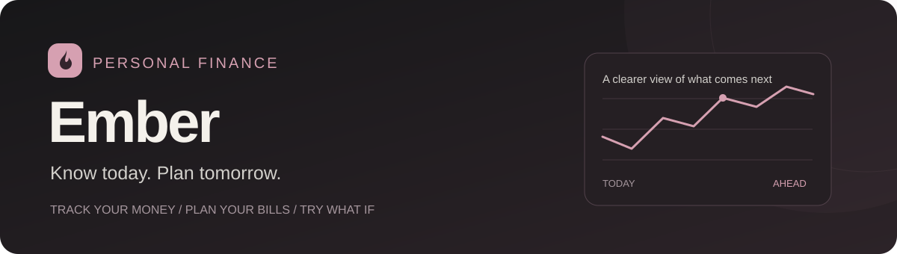

<p align="center">
  
</p>

<p align="center">
  <a href="https://github.com/Arad-d/ember/actions/workflows/flutter.yml"></a>
  
  
</p>

<p align="center">
  Personal finance with a clearer view of what comes next.<br>
  Track your money, plan your bills, and try a decision before committing to it.
</p>

<p align="center">
  <a href="https://arad-d.github.io/ember/"><strong>Try the live demo</strong></a> ·
  <a href="#get-started">Run locally</a> ·
  <a href="docs/ARCHITECTURE.md">Architecture</a> ·
  <a href="SECURITY.md">Security</a>
</p>

## A little more clarity about your money

Ember brings everyday tracking and future planning into one place. See where your money went, which bills are approaching, and how a purchase or delayed payday could change your balance.

**No account is needed to explore it.** The demo starts with fictional, editable data saved in your browser. No shared database is connected. Optional Supabase sync lets you connect your own backend.

<table>
  <tr><th>Your money today</th><th>Your next few weeks</th><th>Your next decision</th></tr>
  <tr>
    <td></td>
    <td></td>
    <td></td>
  </tr>
</table>

## What you can do

| | In Ember |
| --- | --- |
| **Track everyday money** | Record expenses and income, manage accounts, and transfer between accounts in the same currency. Search transactions and explore monthly and category summaries. |
| **Stay ahead of bills** | Add a due date, edit or postpone a bill, and record payment. Export a calendar event with an optional alert. |
| **Plan around payday** | Combine balances, expected income, upcoming bills, and a safety buffer to see projected low-balance days. Open a daily breakdown to understand the result. |
| **Try “What if?”** | Compare a purchase, delayed income, or a changed bill with your current plan. Simulations leave your actual records untouched. |
| **Use familiar amounts** | IRT (Iranian toman), USD, EUR, and GBP. English digit entry, exact integer calculations, and automatic thousands grouping for toman. |
| **Choose how to store data** | Local demo storage by default; optional authenticated Supabase sync using ownership policies and atomic bill/income recording. |

## Get started

Open the **[live demo](https://arad-d.github.io/ember/)**, or install [Flutter](https://docs.flutter.dev/get-started/install) and run it locally:

```sh
git clone https://github.com/Arad-d/ember.git
cd ember
flutter pub get
flutter run -d chrome
```

**Try this:** open **Plan**, add expected income and an upcoming bill, then choose **What if?** to compare a purchase with the current plan.

Demo changes stay in that browser. Use fictional records in the public demo. See [SETUP.md](SETUP.md) for web builds and connecting your own backend.

## Under the hood

- **Flutter / Dart:** responsive layouts for narrow phone screens and desktop.
- **Exact amounts:** whole toman or cents/pence, with no floating-point money calculations.
- **Forecast engine:** uses entered plans in one currency, processing outflows before inflows on the same day. Tracks daily low and closing balances.
- **Available money:** the lowest projected balance above your selected safety buffer, floored at zero. Spending that has not been entered is not predicted.
- **Isolated simulations:** temporary changes apply to an immutable snapshot and recompute the comparison.
- **Optional cloud sync:** record-level writes, consistent ledger reads, and ownership checks on account references.

Read [the architecture and tradeoffs](docs/ARCHITECTURE.md).

## Quality checks

```sh
flutter analyze
flutter test
flutter build web --release --no-web-resources-cdn --pwa-strategy=none
```

The [GitHub workflow](.github/workflows/flutter.yml) runs secret scanning, analysis, tests, and a release web build before deploying the demo. Action versions are pinned to commit hashes; test jobs use read-only repository access.

Tests cover currency calculations, forecasts and explanations, calendar escaping, simulation isolation, demo startup, cloud-client requests, and forms at phone and desktop widths. Flutter **3.38.3 / Dart 3.10.1** is the checked toolchain. Cloud-client tests use mock responses; they do not validate a deployed database's security.

## Current capabilities

Ember does not connect to banks or process payments. Recording a bill as paid creates an expense entry. Recurring transactions, email alerts, and push notifications are not currently included. Imported calendar events are copies and do not update automatically. Dates use the Gregorian calendar.

Web is the validated target. iOS and macOS scaffolding is included; native builds and signing are not validated. See the [security policy](SECURITY.md) before configuring a backend.

## Author & usage

Created and maintained by **[Arad Delbari](https://github.com/Arad-d)**.

**Copyright © 2026 Arad Delbari. All rights reserved.** Public visibility does not grant a general license to reuse or redistribute this code. See [LICENSE](LICENSE) for the copyright notice and third-party exceptions. Please contact the author for reuse permission.
