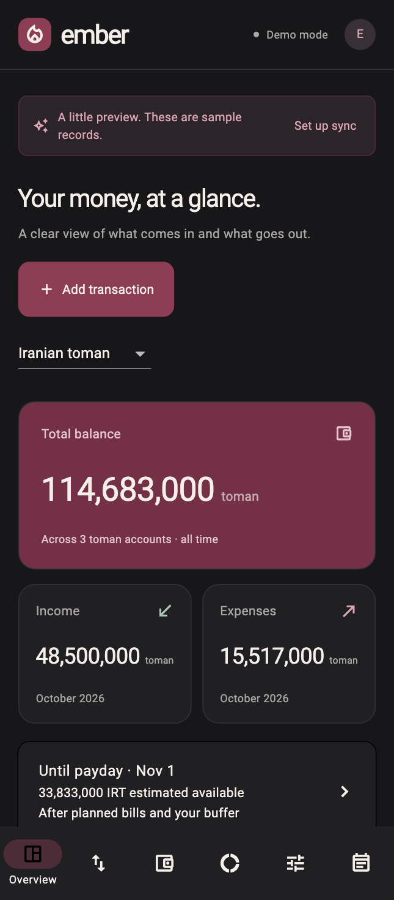
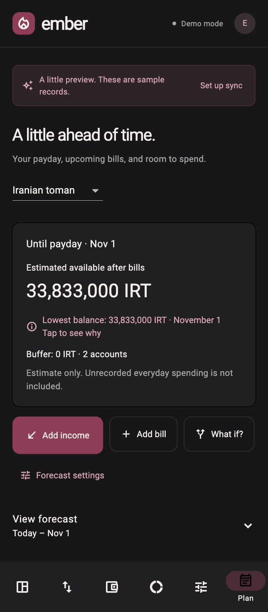
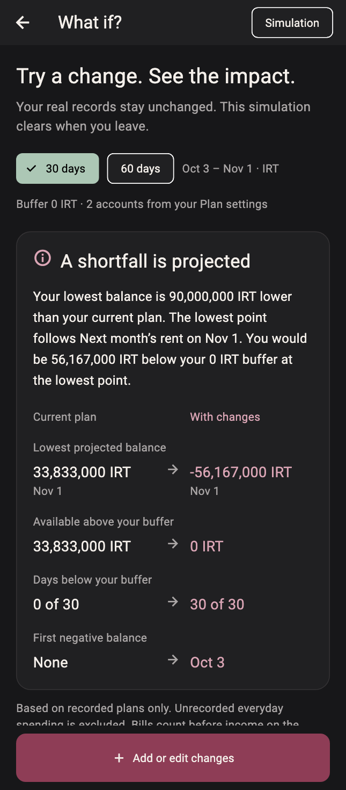

# Ember

A personal finance app built with Flutter: track everyday money, plan upcoming bills, and explore how a purchase or delayed payday could affect your balance.

**Run it without an account or database.** This repository starts with fictional, editable demo data stored on your device. It contains no configured Supabase project or hosted domain. Optional Supabase integration is included for users who want to connect their own backend.

<p align="center">
  
  
  
</p>

## Features

- Expenses, income, accounts, and transfers between accounts using the same currency.
- IRT (Iranian toman), USD, EUR, and GBP; exact integer amounts and English digit entry. Toman fields automatically group thousands.
- Transaction search, monthly summaries, account filters, category breakdowns, and charts.
- Upcoming bills: add, edit, postpone, and record payment. Recording payment creates an expense; it does not move money through a bank.
- Calendar export: download an `.ics` event with an optional alert for an upcoming bill.
- Payday-aware forecasting: combine balances, expected income, bills, and a safety buffer to identify projected low-balance days.
- Forecast explanations: open a daily breakdown and see which movements drive the result.
- What if? planner: compare a purchase, delayed income, or a changed bill with the current plan, without changing ledger records.
- Responsive desktop and phone layouts, with category icons in the transaction picker.
- Optional authenticated Supabase sync, with ownership policies and atomic bill/income recording.

## Run locally

Install [Flutter](https://docs.flutter.dev/get-started/install). This snapshot is checked with **Flutter 3.38.3 / Dart 3.10.1**.

```sh
git clone https://github.com/Arad-d/ember.git
cd ember
flutter pub get
flutter run -d chrome
```

The app opens in **Demo mode**. Try adding a transaction, opening **Plan**, adding expected income, and choosing **What if?**. Demo edits persist in that browser only. No network account is needed to use the demo.

See [SETUP.md](SETUP.md) for web builds, native platform notes, and optional Supabase setup.

## How it works

The money and planning calculations are separate from storage and widgets. Amounts use integers: whole toman, or cents/pence for supported foreign currencies. Forecasts stay within one currency and use recorded plans; everyday spending that has not been entered is not predicted.

The forecast processes outflows before inflows on the same day. It tracks each day's lowest balance as well as its closing balance. Available money is the lowest forecast balance above the selected safety buffer, floored at zero. The What if? planner applies temporary changes to an immutable snapshot and recomputes the comparison.

Read [the architecture and tradeoffs](docs/ARCHITECTURE.md) for the module map, calculation details, and cloud data model.

## Checks

```sh
flutter analyze
flutter test
flutter build web --release --no-web-resources-cdn --pwa-strategy=none
```

The GitHub workflow performs these checks with a pinned Flutter version. Tests cover currency calculations, forecasts, calendar escaping, simulation isolation, demo behavior, cloud-client requests, and forms at narrow phone and desktop widths. Cloud-client tests use mock responses; they are not a security certification of any deployed database.

## Scope

Ember is a portfolio project. It has no bank connection, payment processing, automatic recurring transactions, email notifications, or web push notifications. Calendar reminders are imported copies and do not update when a bill changes in Ember. Dates use the Gregorian calendar. Web is the validated target; iOS and macOS scaffolding is included, but native builds and signing are not validated.

The original deployment and database are not part of this repository. [Security notes](SECURITY.md) explain how to configure a separate backend safely. Third-party font licensing is retained in `assets/fonts/LICENSE.txt`.
